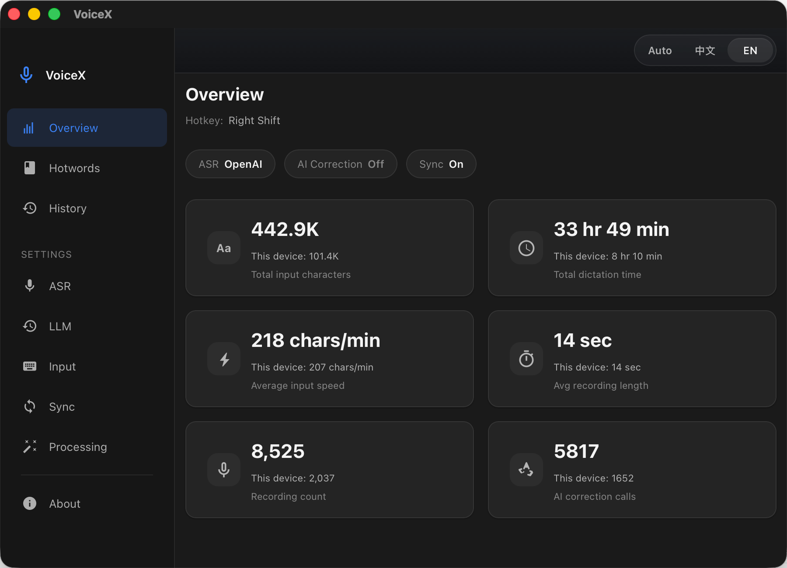
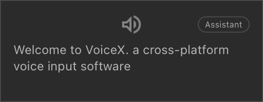

# VoiceX

English | [中文](./README.md)

<p align="center">
  
</p>

<p align="center">
  
</p>

VoiceX is a cross-platform desktop voice input tool. Its overall pipeline is: record audio, provide real-time feedback, recognize speech, optionally correct or translate the result, inject text into the active application, and save or sync the history. The core workflow is similar to other modern voice input tools, but VoiceX still makes its own product choices and trade-offs.

## Highlights

- **Cross-platform** — runs on macOS and Windows with platform-native hotkey capture, tray icon, and text injection.
- **Multiple ASR backends** — switch between eleven cloud and local speech recognition providers to balance accuracy, latency, language coverage, and privacy.
- **One hotkey, multiple gestures** — a single global hotkey drives three interaction modes: tap for hands-free dictation, hold for push-to-talk, double-tap to translate.
- **Real-time HUD overlay** — a lightweight always-on-top display shows live transcription, recording mode, countdown timer, and processing status, and on macOS it follows the active Space when triggered from another desktop.
- **LLM-powered post-processing** — optionally send ASR output through an LLM for correction, translation, or refinement, with customizable prompt templates and dictionary-aware context.
- **Smart text injection** — recognized text is pasted into the active app via clipboard (with automatic backup/restore) or simulated typing, seamlessly.
- **History & statistics** — every dictation is logged with full metadata (duration, device, ASR/LLM model, original vs. corrected text), browsable by date with audio playback and re-transcription.
- **Cross-device sync** — a self-hosted sync server keeps history in sync across your machines.

## Interaction Modes

VoiceX maps three distinct intents to a single configurable hotkey:

| Gesture | Mode | Behavior |
|---|---|---|
| **Tap** (press & release) | Hands-free | Records until silence timeout or max duration; you can keep talking without holding anything. |
| **Hold** (press & hold) | Push-to-talk | Records while the hotkey is held; releases to finalize. |
| **Double-tap** | Translate | Like hands-free, but the result is translated to English via LLM (opt-in). |

Hold threshold and double-tap window are configurable. Press **Escape** at any time to cancel and discard.

## ASR Backends

| Provider | Type | Notes |
|---|---|---|
| Volcengine (Doubao Speech) | Cloud streaming (WebSocket) | Optimized for Chinese; hot-word boosting, ITN, punctuation, DDC |
| Google Cloud Speech-to-Text V2 | Cloud streaming (gRPC) | Multi-language, phrase boost, configurable endpointing |
| Fun-ASR Realtime | Cloud streaming (WebSocket) | DashScope; `fun-asr-realtime` / `fun-asr-flash-8k-realtime`; tuned for low-latency live dictation |
| Qwen (DashScope ASR) | Cloud streaming / batch file upload | Alibaba Cloud; supports `Realtime`, `Batch`, and `Realtime + Batch Refine`; batch paths currently inherit a 5-minute short-audio API cap |
| Gemini Audio Transcription | Cloud batch file upload | `gemini-3.1-flash-lite-preview`; starts after recording stops; supports auto / zh / en / zh+en hints |
| Gemini Live Realtime | Cloud streaming (WebSocket) | `gemini-3.1-flash-live-preview`; realtime input-audio transcription with language hints |
| Cohere Audio Transcription | Cloud batch file upload | `cohere-transcribe-03-2026`; whole-file transcription with explicit ISO-639-1 language hint |
| Soniox Realtime | Cloud streaming (WebSocket) | `stt-rt-v4`; token-based streaming with hotword support and language hints |
| OpenAI ASR | Cloud batch / streaming (WebSocket) | `gpt-4o-transcribe`; dual-mode — batch file upload or realtime WebSocket streaming with VAD |
| ElevenLabs Speech-to-Text | Cloud streaming / batch file upload | `scribe_v2_realtime` / `scribe_v2`; supports realtime transcription, whole-file batch uploads, and optional post-recording batch refine |
| [Coli](https://www.npmjs.com/package/@marswave/coli) | Local offline | SenseVoice / Whisper based; installed separately via npm |

At the moment, Doubao, Qwen, ElevenLabs, Soniox, and Coli are the recommended options. Still, results vary from person to person: pronunciation, wording, and domain-specific vocabulary all affect the final experience.

> **Note:** Cloud ASR services require API keys from their respective providers. Coli must be [installed separately](https://www.npmjs.com/package/@marswave/coli) (`npm i -g @marswave/coli`) before use.

## LLM Integration

VoiceX can optionally pass ASR output through an LLM for correction or translation. Supported providers:

| Provider | Default Model |
|---|---|
| Volcengine (Doubao) | `doubao-seed-2-0-mini-260215` |
| OpenAI (or compatible) | `gpt-4o-mini` |
| Qwen (DashScope) | `qwen3.5-flash` |
| Custom | Any OpenAI-compatible endpoint |

> **Note:** Each LLM provider requires an API key from the respective platform. Configure your chosen provider in **Settings → LLM**.

Features:
- **ASR correction** — fix recognition errors using dictionary context and customizable prompts.
- **Translation** — translate dictation to English, triggered by double-tap gesture.
- **Prompt templates** — full control over correction and translation prompts, with `{{DICTIONARY}}` placeholder for hot-word injection.

## Dictionary & Hot-Words

- Maintain a plain-text word list (one per line) that is sent to the ASR engine as hot-words and injected into LLM prompts.
- **Keyword substitution rules** — define custom find-and-replace rules (exact, contains, or regex) to post-process recognized text.
- **Online hot-word sync** — optionally sync your word list with Volcengine's hot-word platform (requires AK/SK).

## Post-Processing

- **Smart punctuation cleanup** — auto-remove trailing punctuation from short sentences (configurable threshold).
- **Keyword substitution** — regex/exact/contains replacement rules applied before text injection.

## History & Statistics

- Full history grouped by date, with per-record audio playback, copy, and detail view.
- Side-by-side comparison of original ASR output vs. LLM-corrected text.
- Re-transcribe any saved recording with a different ASR backend and optional LLM correction to compare providers on the same audio.
- Failed batch transcriptions are preserved locally with the original audio so you can retry later instead of repeating the whole dictation immediately.
- Configurable retention policies for text and audio (7 / 30 / 180 / 365 days, or forever).
- Overview dashboard: total duration, character count, AI correction calls, average dictation speed — aggregated per device.

## Localization

- Full `zh-CN` and `en-US` coverage across the main UI, HUD overlay, tray menu, and default prompt templates.
- System / Chinese / English interface switcher, with automatic OS locale fallback when `system` is selected.
- Localized history, settings, diagnostics, and provider descriptions, so the bilingual experience is consistent end to end.

## Cross-Device Sync

Memory will likely remain a long-term theme in the AI era. If you use voice input across multiple computers, keeping all input history in one place makes it easier to turn that history into searchable, reusable memory over time. VoiceX supports a lightweight self-hosted sync server (`sync-server/`) to keep text history consistent across devices. Audio files are stored locally only. Running the sync service requires one server reachable by your devices, but resource usage is low.

- Token + shared-secret authentication.
- Real-time sync status (live / connecting / reconnecting / blocked).
- See [sync-server/README.md](./sync-server/README.md) for setup.

## Tech Stack

| Layer | Technology |
|---|---|
| Frontend | Vue 3 · TypeScript · Naive UI · Vite |
| Desktop shell | Tauri 2 (Rust) |
| Audio capture | cpal · Opus (OggOpus) · 16 kHz mono |
| Sync server | Rust · Axum · SQLite |

## Development

### Prerequisites

- [Node.js](https://nodejs.org/) (LTS)
- [pnpm](https://pnpm.io/)
- [Rust](https://rustup.rs/) (stable)
- Tauri 2 system dependencies: [Tauri Prerequisites](https://v2.tauri.app/start/prerequisites/)

### Getting Started

```bash
# Install JS dependencies
pnpm install

# Start the web dev server
pnpm dev

# Start the desktop dev environment (Tauri)
pnpm tauri dev

# Production build
pnpm build
pnpm tauri build
```

### macOS Permissions

VoiceX requires the following three macOS permissions to function properly — global hotkey capture needs Accessibility and Input Monitoring, and audio recording needs Microphone access:

| Permission | Purpose |
|---|---|
| **Accessibility** | Intercept global hotkey events and inject text into other apps |
| **Input Monitoring** | Capture keyboard events system-wide for hotkey detection |
| **Microphone** | Record audio for speech recognition |

Grant these in **System Settings → Privacy & Security** when prompted on first launch.

### macOS Local Signing (recommended)

Without code signing, macOS treats each new build as a different app, which means you have to **re-grant all three permissions above every time you recompile**. By signing builds with a persistent local certificate, macOS recognizes the app identity across rebuilds and your permission grants carry over.

```bash
# One-time setup: create a local code-signing identity in your Keychain
pnpm mac:setup-signing

# Build, sign, and install to /Applications
pnpm mac:build-local
```

`mac:setup-signing` generates a self-signed certificate named "VoiceX Local Code Signing" and imports it into your login keychain (only needed once). `mac:build-local` builds a release, signs it with that identity, and installs to `/Applications` with quarantine flags removed.

> This is only needed for local development builds. CI/CD or distribution builds should use a proper Apple Developer certificate.

### Windows Build

On Windows, no code-signing is needed for local development. Build directly with PowerShell:

```powershell
.\scripts\Build-VoiceX.ps1
```

## Project Structure

```
src/                 # Vue 3 frontend
  components/        #   Shared UI components
  views/             #   Route pages (Overview, History, Dictionary, Settings, About)
  stores/            #   Pinia state management
  hud/               #   Lightweight HUD overlay
src-tauri/           # Tauri (Rust) desktop shell
  src/               #   Tauri commands & core logic
  proto/             #   gRPC proto definitions (Google Cloud Speech)
  vendor/            #   Vendored dependencies (audiopus_sys, rdev)
sync-server/         # Self-hosted history sync server
tools/llm-bench/     # LLM correction benchmark
scripts/             # Build & signing helper scripts
```

## License

This project is licensed under the [MIT License](./LICENSE).

Third-party component licenses are listed in [THIRD_PARTY_LICENSES](./THIRD_PARTY_LICENSES).
