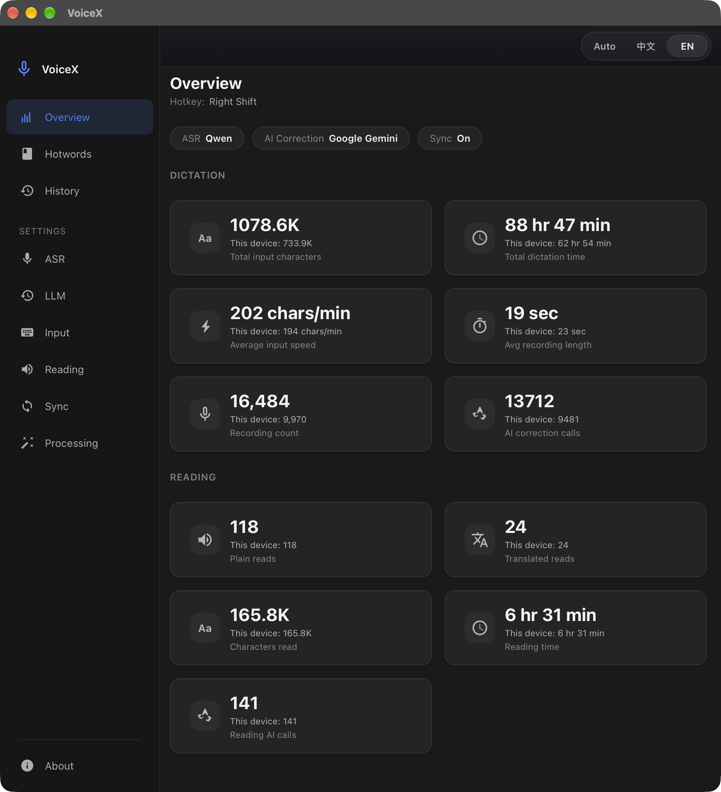
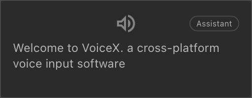

# VoiceX

English | [中文](./README.md)

<p align="center">
  
</p>

<p align="center">
  
</p>

VoiceX is a cross-platform desktop voice input tool. Its overall pipeline is: record audio, provide real-time feedback, recognize speech, optionally correct or translate the result, inject text into the active application, and save or sync the history. The core workflow is similar to other modern voice input tools, but VoiceX still makes its own product choices and trade-offs.

## Highlights

- **Cross-platform** — runs on macOS and Windows with platform-native hotkey capture, tray icon, and text injection.
- **Multiple ASR backends** — switch between fourteen cloud and local speech recognition providers to balance accuracy, latency, language coverage, and privacy.
- **Read selection** — select text in any application and one hotkey reads it aloud, through the system voice or any of the cloud TTS providers (macOS only for now).
- **One hotkey, multiple gestures** — a single global hotkey drives three interaction modes: tap for hands-free dictation, hold for push-to-talk, double-tap to translate.
- **Real-time HUD overlay** — a lightweight always-on-top display shows live transcription, recording mode, countdown timer, and processing status, and on macOS it follows the active Space when triggered from another desktop.
- **LLM-powered post-processing** — optionally send ASR output through an LLM for correction, translation, or refinement, with customizable prompt templates and dictionary-aware context.
- **Smart text injection** — recognized text is pasted into the active app via clipboard (with automatic backup/restore) or simulated typing, with per-app overrides for apps that need a different injection strategy.
- **History & statistics** — every dictation is logged with full metadata (duration, device, ASR/LLM model, original vs. corrected text), browsable by date with audio playback, re-transcription, and replay injection testing.
- **Cross-device sync** — a self-hosted sync server keeps history in sync across your machines.

## Interaction Modes

VoiceX maps three distinct intents to a single configurable hotkey:

| Gesture | Mode | Behavior |
|---|---|---|
| **Tap** (press & release) | Hands-free | Records until silence timeout or max duration; you can keep talking without holding anything. |
| **Hold** (press & hold) | Push-to-talk | Records while the hotkey is held; releases to finalize. |
| **Double-tap** | Translate | Like hands-free, but the result is translated to English via LLM (opt-in). |

Hold threshold and double-tap window are configurable. Press **Escape** at any time to cancel and discard.

## Read Selection

VoiceX also works in the other direction: select text in **any application**,
press **⌥⌘R** (configurable), and it reads the selection aloud. Press again, or
press **Escape**, to stop immediately.

> **macOS only for now.** Reading the selection out of another application goes
> through the macOS Accessibility API; there is no Windows implementation yet, so
> the hotkey is not registered there and still reaches the foreground application.

| | Detail |
|---|---|
| **How text is read** | Straight from the Accessibility API where possible (8–15 ms); otherwise it falls back to a synthetic Command + C and restores your clipboard afterwards. The fallback can be switched off, at the cost of Safari and VS Code support |
| **Speech engines** | The system voice (offline, no setup — by default the one from System Settings → Accessibility → Spoken Content, usually a Siri voice on current macOS); or, in the cloud, Volcengine Doubao Seed-TTS 2.0, Alibaba Cloud Model Studio (default `qwen-audio-3.1-tts-flash` for longer text at about a sixth of 3.0's price; `qwen-audio-3.0-tts-flash` for its 500+ extra basic voices; `qwen3-tts-flash` for dialect voices; `cosyvoice-v3-flash` / `cosyvoice-v3.5-flash`, the latter taking a Voice Design / cloned `voice_id`), Xiaomi MiMo, or Microsoft Azure Speech. Cloud engines stream, so speech starts roughly 0.4–0.6 s after the hotkey; long selections are split at sentence boundaries instead of being truncated. Voice, rate and volume are stored per engine |
| **Yields to dictation** | Starting dictation stops reading — otherwise the microphone would record the speech and transcribe it back |

### How this differs from the built-in "Speak selection"

macOS has its own version (System Settings → Accessibility → Spoken Content,
Option + Esc by default). Both can coexist, and the default hotkeys deliberately
do not collide. The differences:

- **Cloud-quality voices.** The built-in feature can only use local voices, and
  every Chinese voice available to third-party apps on this platform is the
  compact tier. It sounds better by default because it uses a Siri voice, and
  Siri voices are not available to third-party applications. Going through a
  cloud engine sidesteps that ceiling.
- **Per-engine settings**, with a preview button so you can hear before deciding.
- **One hotkey system shared with dictation**, so conflicts are surfaced in the
  settings page instead of silently swallowing a key.

The built-in feature does things VoiceX does not: word-level highlighting, and
working in places we cannot reach such as the login window.

### Where the text goes

- The default engine is the **system voice, entirely local** — selected text
  never leaves the machine.
- With a cloud engine selected, **the selected text is sent to that provider**
  for synthesis. The settings page says so when a cloud engine is chosen.
- Reading history is **not** stored, and neither is synthesized audio. Ordinary
  logs record length, how the text was read, the target application and error
  codes — never the text itself.

## ASR Backends

| Provider | Type | Notes |
|---|---|---|
| Volcengine (Doubao Speech) | Cloud streaming (WebSocket) | Optimized for Chinese; hot-word boosting, ITN, punctuation, DDC |
| Google Cloud Speech-to-Text V2 | Cloud streaming (gRPC) | Multi-language, phrase boost, configurable endpointing |
| Fun-ASR Realtime | Cloud streaming (WebSocket) | DashScope; `fun-asr-realtime` / `fun-asr-flash-8k-realtime`; tuned for low-latency live dictation; selected models accept the dictionary as recognition context |
| Qwen (DashScope ASR) | Cloud streaming / batch file upload | Alibaba Cloud; both model generations — the new `qwen-audio-3.1/3.0-asr-flash(-streaming)` (3.1 is billed per token, roughly 60–90% cheaper than 3.0) and the existing Qwen3-ASR; supports `Realtime`, `Batch`, and `Realtime + Batch Refine`; the new generation adds inline hotwords with a weight, precompiled vocabularies, context, and semantic endpointing; batch paths currently inherit a 5-minute short-audio API cap |
| Gemini Audio Transcription | Cloud batch file upload | Default `gemini-3.5-flash-lite`; also `gemini-3.5-transcribe` and preview `gemini-3.1-flash-lite-preview`; starts after recording stops; supports auto / zh / en / zh+en hints |
| Gemini Live Realtime | Cloud streaming (WebSocket) | Default `gemini-3.1-flash-live-preview`, also `gemini-3.5-transcribe-live`; realtime input-audio transcription with language hints |
| Cohere Audio Transcription | Cloud batch file upload | `cohere-transcribe-03-2026`; whole-file transcription with explicit ISO-639-1 language hint |
| Soniox Realtime | Cloud streaming (WebSocket) | Default `stt-rt-v5` (`stt-rt-v4` remains selectable); token-based streaming with hotword support and language hints |
| StepAudio 2.5 ASR | Cloud batch file upload (HTTP + SSE) | StepFun; `stepaudio-2.5-asr`; uploads the full recording after capture stops, supports up to 30 minutes, and returns incremental SSE events |
| Xiaomi MiMo ASR | Cloud batch file upload (HTTP + JSON) | Xiaomi; `mimo-v2.5-asr`; OpenAI-compatible chat/completions endpoint; uploads the full recording after capture stops, compressed to MP3 (macOS/Linux) or WAV (Windows) to fit the 10 MB input limit |
| OpenAI ASR | Cloud batch / streaming (WebSocket) | `gpt-transcribe` / `gpt-live-transcribe`; dual-mode — batch file upload or realtime WebSocket streaming. The dictionary is sent through the native `keywords` parameter, with multi-language `languages` and a Realtime latency tier |
| ElevenLabs Speech-to-Text | Cloud streaming / batch file upload | `scribe_v2_realtime` / `scribe_v2`; supports realtime transcription, whole-file batch uploads, and optional post-recording batch refine |
| [Coli](https://www.npmjs.com/package/@marswave/coli) | Local offline | SenseVoice / Whisper based; installed separately via npm |
| Qwen3-ASR (Local) | Local offline batch | Alibaba's open-weight model (Apache-2.0), fully offline; driven through the external `qwen-asr` CLI. Text appears after you release the hotkey — no incremental output yet |

At the moment, Doubao, Qwen, ElevenLabs, Soniox, and Coli are the recommended options. Still, results vary from person to person: pronunciation, wording, and domain-specific vocabulary all affect the final experience.

> **Note:** Cloud ASR services require API keys from their respective providers. Coli must be [installed separately](https://www.npmjs.com/package/@marswave/coli) (`npm i -g @marswave/coli`) before use. Streaming recognition (including Qwen-Audio 3.0) follows the system proxy: WinHTTP (with PAC/WPAD) on Windows, System Configuration plus PAC on macOS.

For the offline option, see [Local offline recognition (Qwen3-ASR)](#local-offline-recognition-qwen3-asr) below.

### Local offline recognition (Qwen3-ASR)

Runs entirely on your machine; audio never leaves the device. It is currently driven through the external `qwen-asr` CLI, which needs two setup steps.

**1. Install the CLI** (requires the Rust toolchain):

```bash
cargo install qwen-asr-cli
```

This installs to `~/.cargo/bin` by default. VoiceX searches `PATH` and that directory automatically, so the command path can usually be left blank.

**2. Download the model**:

```bash
qwen-asr download qwen3-asr-0.6b --output ~/models
```

The 0.6B model is about 1.9 GB. If the download breaks off partway — common for large files served through the HuggingFace CDN — a resumable transfer is more reliable:

```bash
curl -L -C - --retry 8 -o ~/models/qwen3-asr-0.6b/model.safetensors "https://huggingface.co/Qwen/Qwen3-ASR-0.6B/resolve/main/model.safetensors"
```

**3. Configure it**: pick **Qwen3-ASR (Local)** on the ASR settings page and set "Model Directory" to the path from step 2 (e.g. `~/models/qwen3-asr-0.6b`; `~` is expanded). Leave the command path blank for auto-detection.

Worth knowing:

- **Force Language defaults to Chinese — keep it set.** On auto-detect the model may switch to English output partway through an utterance.
- **Dictionary biasing is on by default.** It is this model's only hotword channel (passed as a biasing prompt) and clearly helps with proper nouns. Capped at 60 entries.
- **No incremental output yet** — text appears after you release the hotkey; short utterances typically return in under a second.
- **macOS / Linux only.** The provider is unavailable on Windows; use a cloud service or Coli there.
- The model has no ITN, so "one thousand two hundred thirty" is not converted to "1230".

## LLM Integration

VoiceX can optionally pass ASR output through an LLM for correction or translation. Supported providers:

| Provider | Default Model |
|---|---|
| Volcengine (Doubao) | `doubao-seed-2-0-mini-260215` |
| OpenAI (or compatible) | `gpt-4o-mini` |
| Qwen (DashScope) | `qwen3.5-flash` |
| Google Gemini | `gemini-3.5-flash-lite` |
| Custom | Any OpenAI-compatible endpoint |

> **Note:** Each LLM provider requires an API key from the respective platform. Configure your chosen provider in **Settings → LLM**.

Features:
- **ASR correction** — fix recognition errors using dictionary context and customizable prompts.
- **Translation** — translate dictation to English, triggered by double-tap gesture.
- **Prompt templates** — full control over correction and translation prompts, with `{{DICTIONARY}}` placeholder for hot-word injection.
- **Connectivity test** — send one real correction request with the active provider and model to inspect latency and output quality.

## Dictionary & Hot-Words

- Maintain a plain-text word list (one per line) that is sent to the ASR engine as hot-words and injected into LLM prompts.
- **Keyword substitution rules** — define custom find-and-replace rules (exact, contains, or regex) to post-process recognized text.
- **Online hot-word sync** — optionally sync your word list with Volcengine's hot-word platform (requires AK/SK).

## Post-Processing

- **Smart punctuation cleanup** — auto-remove trailing punctuation from short sentences (configurable threshold).
- **Keyword substitution** — regex/exact/contains replacement rules applied before text injection.

## Text Injection

- Global support for clipboard paste and simulated typing modes.
- Per-app overrides can be created from recent target apps, so standard text fields can keep clipboard paste while editors that are sensitive to paste events can switch to typing.
- On macOS, VoiceX records the target app when the hotkey starts, reducing the chance that the HUD or main window changes the injection target.

## History & Statistics

- Full history grouped by date, with per-record audio playback, copy, and detail view.
- Side-by-side comparison of original ASR output vs. LLM-corrected text.
- Re-transcribe any saved recording with a different ASR backend and optional LLM correction to compare providers on the same audio; replay the final text into the current app to test the full end-to-end flow.
- Failed batch transcriptions are preserved locally with the original audio so you can retry later instead of repeating the whole dictation immediately.
- Configurable retention policies for text and audio (7 / 30 / 180 / 365 days, or forever).
- Overview dashboard: total duration, character count, AI correction calls, average dictation speed — aggregated per device.

## Localization

- Full `zh-CN` and `en-US` coverage across the main UI, HUD overlay, tray menu, and default prompt templates.
- System / Chinese / English interface switcher, with automatic OS locale fallback when `system` is selected.
- Localized history, settings, diagnostics, and provider descriptions, so the bilingual experience is consistent end to end.

## Cross-Device Sync

Memory will likely remain a long-term theme in the AI era. If you use voice input across multiple computers, keeping all input history in one place makes it easier to turn that history into searchable, reusable memory over time. VoiceX supports a lightweight self-hosted sync server (`sync-server/`) to keep text history consistent across devices. Audio files are stored locally only. Running the sync service requires one server reachable by your devices, but resource usage is low.

- Token + shared-secret authentication.
- Real-time sync status (live / connecting / reconnecting / blocked).
- See [sync-server/README.md](./sync-server/README.md) for setup.

## Tech Stack

| Layer | Technology |
|---|---|
| Frontend | Vue 3 · TypeScript · Naive UI · Vite |
| Desktop shell | Tauri 2 (Rust) |
| Audio capture | cpal · Opus (OggOpus) · 16 kHz mono |
| Sync server | Rust · Axum · SQLite |

## Development

### Prerequisites

- [Node.js](https://nodejs.org/) (LTS)
- [pnpm](https://pnpm.io/)
- [Rust](https://rustup.rs/) (stable)
- Tauri 2 system dependencies: [Tauri Prerequisites](https://v2.tauri.app/start/prerequisites/)

### Getting Started

```bash
# Install JS dependencies
pnpm install

# Start the web dev server
pnpm dev

# Start the desktop dev environment (Tauri)
pnpm tauri dev

# Production build
pnpm build
pnpm tauri build
```

### macOS Permissions

VoiceX requires the following three macOS permissions to function properly — global hotkey capture needs Accessibility and Input Monitoring, and audio recording needs Microphone access:

| Permission | Purpose |
|---|---|
| **Accessibility** | Intercept global hotkey events and inject text into other apps |
| **Input Monitoring** | Capture keyboard events system-wide for hotkey detection |
| **Microphone** | Record audio for speech recognition |

Grant these in **System Settings → Privacy & Security** when prompted on first launch.

### macOS Local Signing (recommended)

Without code signing, macOS treats each new build as a different app, which means you have to **re-grant all three permissions above every time you recompile**. By signing builds with a persistent local certificate, macOS recognizes the app identity across rebuilds and your permission grants carry over.

```bash
# One-time setup: create a local code-signing identity in your Keychain
pnpm mac:setup-signing

# Build, sign, and install to /Applications
pnpm mac:build-local
```

`mac:setup-signing` generates a self-signed certificate named "VoiceX Local Code Signing" and imports it into your login keychain (only needed once). `mac:build-local` builds a release, signs it with that identity, and installs to `/Applications` with quarantine flags removed.

> This is only needed for local development builds. CI/CD or distribution builds should use a proper Apple Developer certificate.

### Windows Build

On Windows, no code-signing is needed for local development. Build directly with PowerShell:

```powershell
.\scripts\Build-VoiceX.ps1
```

## Project Structure

```
src/                 # Vue 3 frontend
  components/        #   Shared UI components
  views/             #   Route pages (Overview, History, Dictionary, Settings, About)
  stores/            #   Pinia state management
  hud/               #   Lightweight HUD overlay
src-tauri/           # Tauri (Rust) desktop shell
  src/               #   Tauri commands & core logic
  proto/             #   gRPC proto definitions (Google Cloud Speech)
  vendor/            #   Vendored dependencies (audiopus_sys, rdev)
sync-server/         # Self-hosted history sync server
tools/llm-bench/     # LLM correction benchmark
scripts/             # Build & signing helper scripts
```

## License

This project is licensed under the [MIT License](./LICENSE).

Third-party component licenses are listed in [THIRD_PARTY_LICENSES](./THIRD_PARTY_LICENSES).
