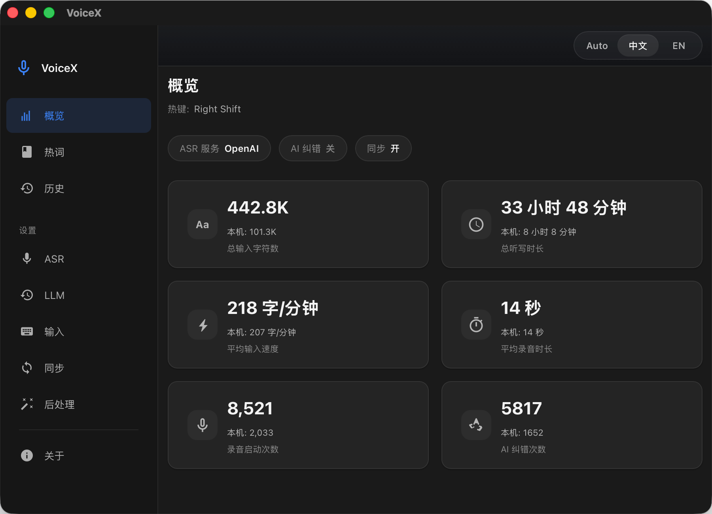
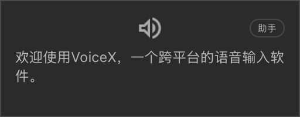

# VoiceX

[English](./README.en.md) | 中文

<p align="center">
  
</p>

<p align="center">
  
</p>

VoiceX 是一个跨平台桌面语音输入工具，目标是把"开口说话"变成一种足够快、足够轻、可以长期使用的输入方式。

它关注的不是单纯把语音转成文字，而是把整条输入链路串成完整闭环：开始录音、实时反馈、识别、按需纠正或翻译、把文本送进当前应用、再把历史保留下来。

## 亮点

- **一键多用** — 单个全局热键驱动三种交互模式：轻点启动免提听写、长按进入按住说话、双击触发翻译。
- **实时 HUD 浮层** — 轻量置顶窗口，实时显示转写文本、录音模式、倒计时和处理状态，不打断当前工作流。
- **多 ASR 后端** — 在九种云端和本地语音识别引擎间自由切换，兼顾准确率、延迟、语种覆盖和隐私。
- **LLM 后处理** — 可选将 ASR 输出交给大模型做纠错、翻译或润色，支持自定义 prompt 模板和词典上下文注入。
- **智能文本注入** — 识别结果通过剪贴板粘贴（自动备份/恢复原内容）或模拟键入送入当前应用，无缝衔接。
- **历史记录与统计** — 每次听写保留完整元数据（时长、设备、ASR/LLM 模型、原文 vs. 纠正文本），按日期浏览，并支持录音回放与重新转录。
- **完整双语界面** — 整个应用壳层、设置页、历史记录、HUD 浮层、托盘菜单和内置默认 prompt 都支持 `zh-CN` / `en-US` 双语。
- **跨设备同步** — 自建同步服务器，在多台设备间保持历史一致。
- **跨平台** — 同时支持 macOS 和 Windows，使用平台原生热键捕获、托盘图标和文本注入。

## 交互模式

VoiceX 通过一个可配置的全局热键映射三种不同意图：

| 手势 | 模式 | 行为 |
|---|---|---|
| **轻点**（按下即松） | 免提听写 | 持续录音直到静音超时或最大时长，无需一直按住。 |
| **长按**（按住不放） | 按住说话 | 按住期间录音，松开即结束。 |
| **双击** | 翻译 | 与免提听写相同，但结果通过 LLM 翻译为英文（需开启）。 |

长按阈值和双击窗口均可调。录音期间按 **Escape** 可随时取消并丢弃。

## ASR 后端

| 提供商 | 类型 | 说明 |
|---|---|---|
| 火山引擎（豆包语音） | 云端流式 (WebSocket) | 中文优化；支持热词增强、ITN、标点、DDC |
| Google Cloud Speech-to-Text V2 | 云端流式 (gRPC) | 多语种，Phrase Boost，可配置端点检测 |
| 通义千问（DashScope 实时 ASR） | 云端流式 (WebSocket) | 阿里云；`qwen3-asr-flash-realtime` 模型 |
| Gemini Audio Transcription | 云端批量文件识别 | `gemini-3.1-flash-lite-preview`；录音结束后上传整段音频；支持自动 / 中文 / English / 中英混合提示 |
| Gemini Live Realtime | 云端流式 (WebSocket) | `gemini-3.1-flash-live-preview`；基于输入音频转写的实时识别，可附带语言提示 |
| Cohere Audio Transcription | 云端批量文件识别 | `cohere-transcribe-03-2026`；整段音频上传识别，需显式指定 ISO-639-1 语言码 |
| Soniox Realtime | 云端流式 (WebSocket) | `stt-rt-v4`；基于 token 的流式识别，支持热词和语言提示 |
| OpenAI ASR | 云端批量 / 流式 (WebSocket) | `gpt-4o-transcribe`；双模式——批量文件上传或实时 WebSocket 流式识别（含 VAD） |
| [Coli](https://www.npmjs.com/package/@marswave/coli) | 本地离线 | 基于 SenseVoice / Whisper，需通过 npm 单独安装 |

流式后端以 100 ms Opus 编码分片发送音频，保证低延迟；批量后端则会在录音结束后上传整段音频，更适合离线对比和高质量重转录。

> **提示：** 云端 ASR 服务需要到对应平台申请 API Key。火山引擎只需填写 **App Key** 和 **Access Key**，其余参数均有合理默认值。Coli 需要事先通过 npm 全局安装（`npm i -g @marswave/coli`），详见 [Coli 文档](https://www.npmjs.com/package/@marswave/coli)。

## LLM 集成

VoiceX 可选将 ASR 输出交给 LLM 做纠错或翻译。支持的提供商：

| 提供商 | 默认模型 |
|---|---|
| 火山引擎（豆包） | `doubao-seed-2-0-mini-260215` |
| OpenAI（或兼容接口） | `gpt-4o-mini` |
| 通义千问（DashScope） | `qwen3.5-flash` |
| 自定义 | 任何 OpenAI 兼容端点 |

> **提示：** 每个 LLM 提供商都需要到对应平台申请 API Key，在 **设置 → LLM** 中配置即可。

能力：
- **ASR 纠错** — 结合词典上下文和可自定义 prompt 修正识别错误。
- **翻译** — 将听写内容翻译为英文，由双击手势触发。
- **Prompt 模板** — 完全自定义纠错和翻译 prompt，支持 `{{DICTIONARY}}` 占位符注入热词。

## 词典与热词

- 维护纯文本词表（每行一个），同时作为 ASR 热词和 LLM prompt 上下文注入。
- **关键词替换规则** — 定义自定义查找替换规则（精确、包含或正则），对识别结果做后处理。
- **在线热词同步** — 可选与火山引擎热词平台双向同步（需配置 AK/SK）。

## 后处理

- **智能标点清理** — 短句自动去除末尾标点（阈值可配置）。
- **关键词替换** — 正则/精确/包含替换规则，在文本注入前执行。

## 历史记录与统计

- 全量历史按日期分组，每条记录支持录音回放、复制和详情查看。
- 原始 ASR 输出与 LLM 纠正结果的并排对比。
- 可对任意历史录音重新转录，切换不同 ASR 后端并按需叠加 LLM 纠错，方便做同音频对比。
- 可配置文本和录音的保留策略（7 / 30 / 180 / 365 天或永久保留）。
- 概览仪表盘：总时长、字符数、AI 纠正次数、平均听写速度——按设备汇总。

## 本地化

- 主界面、HUD 浮层、托盘菜单和默认 prompt 模板都完整覆盖 `zh-CN` 与 `en-US`。
- 支持系统 / 中文 / English 三档界面切换；选择 `system` 时会自动跟随系统语言。
- 设置、历史、诊断信息和 provider 说明都做了双语处理，整体体验保持一致。

## 跨设备同步

轻量自建同步服务器（`sync-server/`），跨设备保持文本历史一致。录音文件仅保存在本地。

- Token + 共享密钥认证。
- 实时同步状态（已连接 / 连接中 / 重连中 / 配置缺失）。
- 详见 [sync-server/README.md](./sync-server/README.md)。

## 技术栈

| 层 | 技术 |
|---|---|
| 前端 | Vue 3 · TypeScript · Naive UI · Vite |
| 桌面壳 | Tauri 2 (Rust) |
| 音频采集 | cpal · Opus (OggOpus) · 16 kHz 单声道 |
| 同步服务端 | Rust · Axum · SQLite |

## 开发

### 前置条件

- [Node.js](https://nodejs.org/) (LTS)
- [pnpm](https://pnpm.io/)
- [Rust](https://rustup.rs/) (stable)
- Tauri 2 系统依赖：参考 [Tauri Prerequisites](https://v2.tauri.app/start/prerequisites/)

### 开始

```bash
# 安装 JS 依赖
pnpm install

# 启动 Web 开发环境
pnpm dev

# 启动桌面开发环境（含 Tauri）
pnpm tauri dev

# 构建生产版本
pnpm build
pnpm tauri build
```

### macOS 权限要求

VoiceX 需要以下三项 macOS 权限才能正常工作——全局热键捕获依赖辅助功能和输入监控，录音依赖麦克风权限：

| 权限 | 用途 |
|---|---|
| **辅助功能 (Accessibility)** | 拦截全局热键事件，向其他应用注入文本 |
| **输入监控 (Input Monitoring)** | 在系统范围内捕获键盘事件以检测热键 |
| **麦克风 (Microphone)** | 录音用于语音识别 |

首次启动时系统会弹出授权提示，在 **系统设置 → 隐私与安全性** 中授予即可。

### macOS 本地签名（推荐）

如果不进行代码签名，macOS 会将每次编译的新版本视为不同应用，导致**每次重新编译后都需要重新授予上述三项权限**。通过本地自签名证书签名构建产物，macOS 能跨编译识别应用身份，权限授予持续有效。

```bash
# 一次性操作：在钥匙串中创建本地代码签名身份
pnpm mac:setup-signing

# 构建、签名并安装到 /Applications
pnpm mac:build-local
```

`mac:setup-signing` 生成名为 "VoiceX Local Code Signing" 的自签名证书并导入到登录钥匙串（只需执行一次）。`mac:build-local` 构建 Release 版本，用该证书签名，然后安装到 `/Applications` 并移除隔离标记。

> 仅用于本地开发构建。CI/CD 或分发构建应使用正式的 Apple 开发者证书。

### Windows 构建

Windows 上本地开发不需要代码签名，直接用 PowerShell 构建即可：

```powershell
.\scripts\Build-VoiceX.ps1
```

### Release 发布流程

如果只是为了产出 Windows 安装包，其实不需要再准备一台 Windows 开发机。GitHub Actions 可以直接在原生的 Windows runner 上构建 Tauri 应用，并把生成的安装包自动回传到同一个 GitHub Release。

仓库里现在包含 `.github/workflows/windows-release.yml`。当你发布一个 GitHub Release 时，这个 workflow 会自动检出对应 tag，在 `windows-latest` 上构建 Windows bundle，然后把产物附加回该 release。

如果想先试跑一次，也可以在 GitHub 的 Actions 页面手动触发这个 workflow，并填一个已经存在的 tag。手动模式既可以只把结果作为短期保留的 Actions artifact 上传，也可以在你显式开启时，直接把构建好的 Windows 安装包补传到这个 tag 对应的现有 release。

推荐流程：

1. 先同步更新 `package.json`、`src-tauri/Cargo.toml` 和 `src-tauri/tauri.conf.json` 里的版本号。
2. 如果你仍然希望在本机签名或验证 macOS 安装包，就继续在 Mac 本地构建 macOS 版本。
3. 把代码和 tag 推到 GitHub；如果想先验证 Windows 构建，可以先去 Actions 页面手动跑一次。
4. 准备正式发布时，再为这个 tag 发布 GitHub Release。
5. 等待 `windows-release` workflow 跑完，Windows 安装包会自动出现在这个 release 的附件里。

这个 workflow 只接受已经包含在 `main` 分支历史里的 tag，对侧分支或实验分支误打的 tag 会直接拦下来，避免误触发正式的 Windows 发布构建。

如果后面你把 Apple Developer 的签名凭据也放进 GitHub Actions，这套方式还可以继续扩展成自动构建 macOS release 产物。

### LLM 基准测试工具（可选）

`tools/llm-bench/` 提供了一个用于评估不同 LLM 对语音识别文本纠正能力的基准工具。使用前需从 `config.example.toml` 创建本地 `config.toml` 并填入 API Key。

## 项目结构

```
src/                 # Vue 3 前端
  components/        #   共享 UI 组件
  views/             #   路由页面 (Overview, History, Dictionary, Settings, About)
  stores/            #   Pinia 状态管理
  hud/               #   轻量 HUD 覆盖层
src-tauri/           # Tauri (Rust) 桌面壳
  src/               #   Tauri commands & 核心逻辑
  proto/             #   gRPC proto 定义 (Google Cloud Speech)
  vendor/            #   Vendored 依赖 (audiopus_sys, rdev)
sync-server/         # 自建历史同步服务端
tools/llm-bench/     # LLM 纠正能力基准测试
scripts/             # 构建与签名辅助脚本
```

## License

本项目基于 [MIT License](./LICENSE) 开源。

项目包含的第三方组件的许可信息详见 [THIRD_PARTY_LICENSES](./THIRD_PARTY_LICENSES)。
