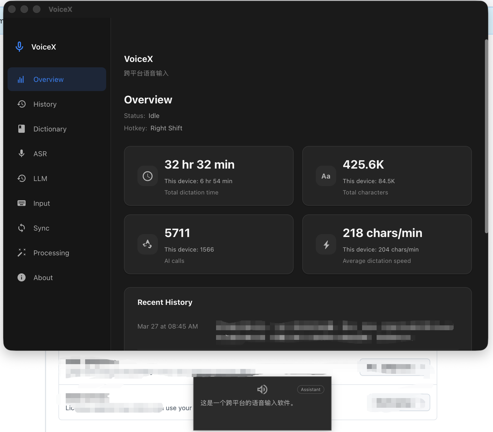

# VoiceX

English | [中文](./README.zh-CN.md)

<p align="center">
  
</p>

VoiceX is a cross-platform desktop voice input tool that turns speaking into a fast, lightweight, and sustainable way to type.

Rather than simply converting speech to text, VoiceX connects the entire input pipeline into a complete loop — start recording, get real-time feedback, recognize speech, optionally correct or translate the result, inject text into the active application, and keep a searchable history.

## Highlights

- **One hotkey, multiple gestures** — a single global hotkey drives three interaction modes: tap for hands-free dictation, hold for push-to-talk, double-tap to translate.
- **Real-time HUD overlay** — a lightweight always-on-top display shows live transcription, recording mode, countdown timer, and processing status without interrupting your workflow.
- **Multiple ASR backends** — switch between four cloud and local speech recognition providers to balance accuracy, latency, language, and privacy.
- **LLM-powered post-processing** — optionally send ASR output through an LLM for correction, translation, or refinement, with customizable prompt templates and dictionary-aware context.
- **Smart text injection** — recognized text is pasted into the active app via clipboard (with automatic backup/restore) or simulated typing, seamlessly.
- **History & statistics** — every dictation is logged with full metadata (duration, device, ASR/LLM model, original vs. corrected text), browsable by date with audio playback.
- **Cross-device sync** — a self-hosted sync server keeps history in sync across your machines.
- **Cross-platform** — runs on macOS and Windows with platform-native hotkey capture, tray icon, and text injection.

## Interaction Modes

VoiceX maps three distinct intents to a single configurable hotkey:

| Gesture | Mode | Behavior |
|---|---|---|
| **Tap** (press & release) | Hands-free | Records until silence timeout or max duration; you can keep talking without holding anything. |
| **Hold** (press & hold) | Push-to-talk | Records while the hotkey is held; releases to finalize. |
| **Double-tap** | Translate | Like hands-free, but the result is translated to English via LLM (opt-in). |

Hold threshold and double-tap window are configurable. Press **Escape** at any time to cancel and discard.

## ASR Backends

| Provider | Type | Notes |
|---|---|---|
| Volcengine (Doubao Speech) | Cloud streaming (WebSocket) | Optimized for Chinese; hot-word boosting, ITN, punctuation, DDC |
| Google Cloud Speech-to-Text V2 | Cloud streaming (gRPC) | Multi-language, phrase boost, configurable endpointing |
| Qwen (DashScope Realtime ASR) | Cloud streaming (WebSocket) | Alibaba Cloud; `qwen3-asr-flash-realtime` model |
| [Coli](https://www.npmjs.com/package/@marswave/coli) | Local offline | SenseVoice / Whisper based; installed separately via npm |

All cloud backends stream audio in 100 ms Opus-encoded chunks for low latency.

> **Note:** Cloud ASR services require API keys from their respective providers. For Volcengine, you only need an **App Key** and **Access Key** — all other parameters have sensible defaults. Coli must be [installed separately](https://www.npmjs.com/package/@marswave/coli) (`npm i -g @marswave/coli`) before use.

## LLM Integration

VoiceX can optionally pass ASR output through an LLM for correction or translation. Supported providers:

| Provider | Default Model |
|---|---|
| Volcengine (Doubao) | `doubao-seed-2-0-mini-260215` |
| OpenAI (or compatible) | `gpt-4o-mini` |
| Qwen (DashScope) | `qwen3.5-flash` |
| Custom | Any OpenAI-compatible endpoint |

> **Note:** Each LLM provider requires an API key from the respective platform. Configure your chosen provider in **Settings → LLM**.

Features:
- **ASR correction** — fix recognition errors using dictionary context and customizable prompts.
- **Translation** — translate dictation to English, triggered by double-tap gesture.
- **Prompt templates** — full control over correction and translation prompts, with `{{DICTIONARY}}` placeholder for hot-word injection.

## Dictionary & Hot-Words

- Maintain a plain-text word list (one per line) that is sent to the ASR engine as hot-words and injected into LLM prompts.
- **Keyword substitution rules** — define custom find-and-replace rules (exact, contains, or regex) to post-process recognized text.
- **Online hot-word sync** — optionally sync your word list with Volcengine's hot-word platform (requires AK/SK).

## Post-Processing

- **Smart punctuation cleanup** — auto-remove trailing punctuation from short sentences (configurable threshold).
- **Keyword substitution** — regex/exact/contains replacement rules applied before text injection.

## History & Statistics

- Full history grouped by date, with per-record audio playback, copy, and detail view.
- Side-by-side comparison of original ASR output vs. LLM-corrected text.
- Configurable retention policies for text and audio (7 / 30 / 180 / 365 days, or forever).
- Overview dashboard: total duration, character count, AI correction calls, average dictation speed — aggregated per device.

## Cross-Device Sync

A lightweight self-hosted sync server (`sync-server/`) keeps text history in sync across machines. Audio files are stored locally only.

- Token + shared-secret authentication.
- Real-time sync status (live / connecting / reconnecting / blocked).
- See [sync-server/README.md](./sync-server/README.md) for setup.

## Tech Stack

| Layer | Technology |
|---|---|
| Frontend | Vue 3 · TypeScript · Naive UI · Vite |
| Desktop shell | Tauri 2 (Rust) |
| Audio capture | cpal · Opus (OggOpus) · 16 kHz mono |
| Sync server | Rust · Axum · SQLite |

## Development

### Prerequisites

- [Node.js](https://nodejs.org/) (LTS)
- [pnpm](https://pnpm.io/)
- [Rust](https://rustup.rs/) (stable)
- Tauri 2 system dependencies: [Tauri Prerequisites](https://v2.tauri.app/start/prerequisites/)

### Getting Started

```bash
# Install JS dependencies
pnpm install

# Start the web dev server
pnpm dev

# Start the desktop dev environment (Tauri)
pnpm tauri dev

# Production build
pnpm build
pnpm tauri build
```

### macOS Permissions

VoiceX requires the following three macOS permissions to function properly — global hotkey capture needs Accessibility and Input Monitoring, and audio recording needs Microphone access:

| Permission | Purpose |
|---|---|
| **Accessibility** | Intercept global hotkey events and inject text into other apps |
| **Input Monitoring** | Capture keyboard events system-wide for hotkey detection |
| **Microphone** | Record audio for speech recognition |

Grant these in **System Settings → Privacy & Security** when prompted on first launch.

### macOS Local Signing (recommended)

Without code signing, macOS treats each new build as a different app, which means you have to **re-grant all three permissions above every time you recompile**. By signing builds with a persistent local certificate, macOS recognizes the app identity across rebuilds and your permission grants carry over.

```bash
# One-time setup: create a local code-signing identity in your Keychain
pnpm mac:setup-signing

# Build, sign, and install to /Applications
pnpm mac:build-local
```

`mac:setup-signing` generates a self-signed certificate named "VoiceX Local Code Signing" and imports it into your login keychain (only needed once). `mac:build-local` builds a release, signs it with that identity, and installs to `/Applications` with quarantine flags removed.

> This is only needed for local development builds. CI/CD or distribution builds should use a proper Apple Developer certificate.

### Windows Build

On Windows, no code-signing is needed for local development. Build directly with PowerShell:

```powershell
.\scripts\Build-VoiceX.ps1
```

### LLM Benchmark Tool (optional)

`tools/llm-bench/` provides a benchmark for evaluating LLM correction quality on ASR output. Copy `config.example.toml` to `config.toml` and fill in your API keys before use.

## Project Structure

```
src/                 # Vue 3 frontend
  components/        #   Shared UI components
  views/             #   Route pages (Overview, History, Dictionary, Settings, About)
  stores/            #   Pinia state management
  hud/               #   Lightweight HUD overlay
src-tauri/           # Tauri (Rust) desktop shell
  src/               #   Tauri commands & core logic
  proto/             #   gRPC proto definitions (Google Cloud Speech)
  vendor/            #   Vendored dependencies (audiopus_sys, rdev)
sync-server/         # Self-hosted history sync server
tools/llm-bench/     # LLM correction benchmark
scripts/             # Build & signing helper scripts
```

## License

This project is licensed under the [MIT License](./LICENSE).

Third-party component licenses are listed in [THIRD_PARTY_LICENSES](./THIRD_PARTY_LICENSES).
