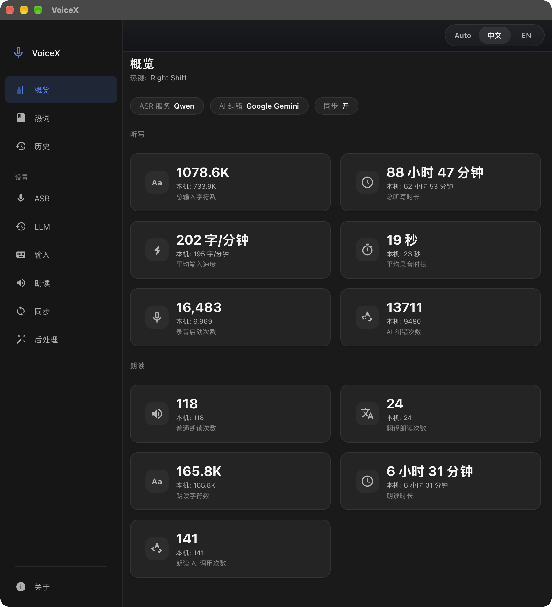
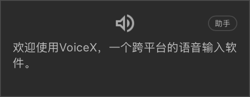

# VoiceX

[English](./README.en.md) | 中文

<p align="center">
  
</p>

<p align="center">
  
</p>

VoiceX 是一个跨平台桌面语音输入工具。整体处理链路为：录音、实时反馈、识别、按需纠正或翻译、把文本送进当前应用、保存并同步历史记录。它和当下流行的语音输入工具在核心流程上类似，但也有一些自身的特点，以及对功能边界的取舍。

## 亮点

- **跨平台** — 同时支持 macOS 和 Windows，使用平台原生热键捕获、托盘图标和文本注入。
- **多 ASR 后端** — 在十四种云端和本地语音识别引擎间自由切换，兼顾准确率、延迟、语种覆盖和隐私。
- **选中朗读** — 在任意应用里选中文字，一个热键就读出来，可选系统语音或多家云端 TTS（目前仅 macOS）。
- **一键多用** — 单个全局热键驱动三种交互模式：轻点启动免提听写、长按进入按住说话、双击触发翻译。
- **实时 HUD 浮层** — 轻量置顶窗口，实时显示转写文本、录音模式、倒计时和处理状态；在 macOS 多桌面场景下也会跟随当前活跃 Space 显示，不打断当前工作流。
- **LLM 后处理** — 可选将 ASR 输出交给大模型做纠错、翻译或润色，支持自定义 prompt 模板和词典上下文注入。
- **智能文本注入** — 识别结果通过剪贴板粘贴（自动备份/恢复原内容）或模拟键入送入当前应用，并可按目标应用单独指定注入方式。
- **历史记录与统计** — 每次听写保留完整元数据（时长、设备、ASR/LLM 模型、原文 vs. 纠正文本），按日期浏览，并支持录音回放、重新转录和重放注入测试。
- **跨设备同步** — 自建同步服务器，在多台设备间保持历史一致。

## 交互模式

VoiceX 通过一个可配置的全局热键映射三种不同意图：

| 手势 | 模式 | 行为 |
|---|---|---|
| **轻点**（按下即松） | 免提听写 | 持续录音直到静音超时或最大时长，无需一直按住。 |
| **长按**（按住不放） | 按住说话 | 按住期间录音，松开即结束。 |
| **双击** | 翻译 | 与免提听写相同，但结果通过 LLM 翻译为英文（需开启）。 |

长按阈值和双击窗口均可调。录音期间按 **Escape** 可随时取消并丢弃。

## 选中朗读

除了把语音变成文字，VoiceX 也能把文字读出来：在**任意应用**里选中一段文本，按 **⌥⌘R**（可改），VoiceX 就会读给你听。再按一次或按 **Escape** 立即停止。

> **目前仅 macOS。** 从其他应用取词依赖 macOS 辅助功能接口，Windows 版尚未实现，该热键在 Windows 上不会被注册，按下时仍然交给前台应用。

| | 说明 |
|---|---|
| **取词方式** | 优先走辅助功能接口直接取（8–15 ms）；取不到时降级为模拟 Command + C，并在读完后还原剪贴板。兼容模式可在设置里关闭，代价是失去 Safari 与 VS Code 支持 |
| **朗读引擎** | 系统语音（离线、免配置，默认使用「系统设置 → 辅助功能 → 朗读内容」里的声音，在当前 macOS 上通常是 Siri 音色）；云端可选火山引擎豆包 Seed-TTS 2.0、阿里云百炼（默认 `qwen-audio-3.1-tts-flash`，单次可读更长文本、价格约为 3.0 的六分之一；`qwen-audio-3.0-tts-flash` 多 500 余个基础音色；`qwen3-tts-flash` 含北京、上海、四川、粤语等方言；`cosyvoice-v3-flash` / `cosyvoice-v3.5-flash`，后者用 Voice Design / 声音复刻的 `voice_id`）、小米 MiMo，或 Microsoft Azure Speech。云端引擎都是流式合成，按下热键后约 0.4–0.6 秒开始出声；超长文本按句切开连续合成，不再截断。每个引擎的音色、语速、音量独立设置 |
| **与听写互斥** | 听写开始时朗读自动停止——否则朗读的声音会被麦克风录进去再转写一遍 |

### 与系统自带「朗读所选内容」的差异

macOS 自带一个同类功能（系统设置 → 辅助功能 → 朗读内容，默认 Option + Esc）。两者可以共存，默认热键也刻意错开。区别在于：

- **可以用云端音质**。系统功能只能用本机音色，而本机第三方可用的中文音色**全部是 compact 档**；它默认听起来更好是因为用了 Siri 音色，而 Siri 音色对第三方应用不开放。VoiceX 接云端引擎绕开了这个天花板。
- **参数按引擎独立**，且能试听后再定。
- **与听写共用一套热键体系**，冲突会在设置页里直接标出来。

反过来，系统功能有 VoiceX 不做的：逐词高亮、在登录界面等我们够不到的地方工作。

### 数据去向

- 默认引擎是**系统语音，完全本地**，选中的文字不出本机。
- 选择云端引擎后，**选中的文字会发送给该供应商**用于合成。设置页在选中云端引擎时会明确写出这一点。
- **不保存**朗读历史，也不保存合成音频。普通日志只记录长度、取词来源、目标应用和错误码，不记录文本内容。

## ASR 后端

| 提供商 | 类型 | 说明 |
|---|---|---|
| 火山引擎（豆包语音） | 云端流式 (WebSocket) | 中文优化；支持热词增强、ITN、标点、DDC |
| Google Cloud Speech-to-Text V2 | 云端流式 (gRPC) | 多语种，Phrase Boost，可配置端点检测 |
| Fun-ASR Realtime | 云端流式 (WebSocket) | DashScope；`fun-asr-realtime` / `fun-asr-flash-8k-realtime`；适合低延迟实时出字；部分模型支持以词典作为上下文增强 |
| 通义千问（DashScope ASR） | 云端流式 / 批量文件识别 | 阿里云；新一代 `qwen-audio-3.1/3.0-asr-flash(-streaming)` 与既有 Qwen3-ASR 两代模型（3.1 按 token 计费，比 3.0 便宜约六成到九成）；支持 `Realtime`、`Batch` 和 `Realtime + 录后 Batch 精修`；新一代模型支持实时热词与权重、预编译热词表、上下文、语义断句；batch 路径当前受 5 分钟短音频接口限制 |
| Gemini Audio Transcription | 云端批量文件识别 | 默认 `gemini-3.5-flash-lite`；也可选 `gemini-3.5-transcribe` 与 preview `gemini-3.1-flash-lite-preview`；录音结束后上传整段音频；支持自动 / 中文 / English / 中英混合提示 |
| Gemini Live Realtime | 云端流式 (WebSocket) | 默认 `gemini-3.1-flash-live-preview`，也可选 `gemini-3.5-transcribe-live`；基于输入音频转写的实时识别，可附带语言提示 |
| Cohere Audio Transcription | 云端批量文件识别 | `cohere-transcribe-03-2026`；整段音频上传识别，需显式指定 ISO-639-1 语言码 |
| Soniox Realtime | 云端流式 (WebSocket) | 默认 `stt-rt-v5`（`stt-rt-v4` 仍可选）；基于 token 的流式识别，支持热词和语言提示 |
| StepAudio 2.5 ASR | 云端批量文件识别 (HTTP + SSE) | 阶跃星辰；`stepaudio-2.5-asr`；录音结束后上传整段音频，支持最长 30 分钟与 SSE 增量返回 |
| 小米 MiMo ASR | 云端批量文件识别 (HTTP + JSON) | 小米；`mimo-v2.5-asr`；OpenAI 兼容的 chat/completions 接口；录音结束后上传整段音频，压缩为 MP3（macOS/Linux）或 WAV（Windows）以满足 10 MB 输入上限 |
| OpenAI ASR | 云端批量 / 流式 (WebSocket) | `gpt-transcribe` / `gpt-live-transcribe`；双模式——批量文件上传或实时 WebSocket 流式识别；词典走原生 `keywords` 参数，支持多语种 `languages` 与 Realtime 延迟档位 |
| ElevenLabs Speech-to-Text | 云端流式 / 批量文件识别 | `scribe_v2_realtime` / `scribe_v2`；支持实时识别、整段批量转录，以及录音结束后的 batch refine |
| [Coli](https://www.npmjs.com/package/@marswave/coli) | 本地离线 | 基于 SenseVoice / Whisper，需通过 npm 单独安装 |
| Qwen3-ASR（本地） | 本地离线批量识别 | 阿里通义开源模型（Apache-2.0），完全离线；通过外部 `qwen-asr` CLI 调用；松开热键后整段出字，暂不支持边说边出字 |

目前推荐豆包、通义千问、ElevenLabs、Soniox 和 Coli，但每个人的体验可能会有差异，发音习惯、用词和使用领域都会影响最终效果。

> **提示：** 云端 ASR 服务需要到对应平台申请 API Key。Coli 需要事先通过 npm 全局安装（`npm i -g @marswave/coli`），详见 [Coli 文档](https://www.npmjs.com/package/@marswave/coli)。流式识别（含 Qwen-Audio 3.0 streaming）会走系统代理：Windows 读 WinHTTP（含 PAC/WPAD），macOS 读系统代理与 PAC。

本地离线方案见下方 [本地离线识别（Qwen3-ASR）](#本地离线识别qwen3-asr)。

### 本地离线识别（Qwen3-ASR）

完全在本机运行，音频不出设备。目前通过外部 `qwen-asr` 命令行工具调用，需要两步准备。

**1. 安装命令行工具**（需要 Rust 工具链）：

```bash
cargo install qwen-asr-cli
```

默认安装到 `~/.cargo/bin`。VoiceX 会自动在 `PATH` 和该目录下查找，通常不需要手动填写命令路径。

**2. 下载模型**：

```bash
qwen-asr download qwen3-asr-0.6b --output ~/models
```

0.6B 模型约 1.9 GB。如果下载中断（大文件经 HuggingFace CDN 时较常见），改用断点续传更可靠：

```bash
curl -L -C - --retry 8 -o ~/models/qwen3-asr-0.6b/model.safetensors "https://huggingface.co/Qwen/Qwen3-ASR-0.6B/resolve/main/model.safetensors"
```

**3. 在设置中配置**：ASR 设置页选择 **Qwen3-ASR（本地）**，把「模型目录」填成上一步的路径（如 `~/models/qwen3-asr-0.6b`，支持 `~`）。命令路径留空即可自动查找。

几点说明：

- **强制语种默认为中文，建议保持。** 设为「自动检测」时模型可能在句子中途整段切换成英文输出。
- **词典增强默认开启。** 这是该模型唯一的热词通道（作为 biasing prompt 传入），对专有名词识别帮助明显，上限 60 条。
- **暂不支持边说边出字**，松开热键后整段出字；短句通常在 1 秒内返回。
- **仅支持 macOS / Linux。** Windows 上该 Provider 不可用，请使用云端服务或 Coli。
- 该模型不支持 ITN，「一千两百三十」不会自动转成「1230」。

## LLM 集成

VoiceX 可选将 ASR 输出交给 LLM 做纠错或翻译。支持的提供商：

| 提供商 | 默认模型 |
|---|---|
| 火山引擎（豆包） | `doubao-seed-2-0-mini-260215` |
| OpenAI（或兼容接口） | `gpt-4o-mini` |
| 通义千问（DashScope） | `qwen3.5-flash` |
| Google Gemini | `gemini-3.5-flash-lite` |
| 自定义 | 任何 OpenAI 兼容端点 |

> **提示：** 每个 LLM 提供商都需要到对应平台申请 API Key，在 **设置 → LLM** 中配置即可。

能力：
- **ASR 纠错** — 结合词典上下文和可自定义 prompt 修正识别错误。
- **翻译** — 将听写内容翻译为英文，由双击手势触发。
- **Prompt 模板** — 完全自定义纠错和翻译 prompt，支持 `{{DICTIONARY}}` 占位符注入热词。
- **连通性测试** — 使用当前 provider 和模型发起一次真实纠错请求，检查响应时间和输出质量。

## 词典与热词

- 维护纯文本词表（每行一个），同时作为 ASR 热词和 LLM prompt 上下文注入。
- **关键词替换规则** — 定义自定义查找替换规则（精确、包含或正则），对识别结果做后处理。
- **在线热词同步** — 可选与火山引擎热词平台双向同步（需配置 AK/SK）。

## 后处理

- **智能标点清理** — 短句自动去除末尾标点（阈值可配置）。
- **关键词替换** — 正则/精确/包含替换规则，在文本注入前执行。

## 文本注入

- 全局支持剪贴板粘贴和模拟键入两种注入方式。
- 可按最近使用的目标应用设置覆盖规则，例如在普通文本框中使用剪贴板粘贴，在对粘贴事件敏感的编辑器中改用模拟键入。
- macOS 上会在热键开始时记录目标应用，降低 HUD 或主窗口抢焦点对注入目标的影响。

## 历史记录与统计

- 全量历史按日期分组，每条记录支持录音回放、复制和详情查看。
- 原始 ASR 输出与 LLM 纠正结果的并排对比。
- 可对任意历史录音重新转录，切换不同 ASR 后端并按需叠加 LLM 纠错，方便做同音频对比；也可以把重新处理后的最终文本重放注入到当前应用，验证完整链路。
- 批量识别失败时，会在本机历史中保留失败记录和录音，方便后续重新转录，不必整段重说。
- 可配置文本和录音的保留策略（7 / 30 / 180 / 365 天或永久保留）。
- 概览仪表盘：总时长、字符数、AI 纠正次数、平均听写速度——按设备汇总。

## 本地化

- 主界面、HUD 浮层、托盘菜单和默认 prompt 模板都完整覆盖 `zh-CN` 与 `en-US`。
- 支持系统 / 中文 / English 三档界面切换；选择 `system` 时会自动跟随系统语言。
- 设置、历史、诊断信息和 provider 说明都做了双语处理，整体体验保持一致。

## 跨设备同步

记忆会是 AI 时代的长期主题。如果你在多台电脑上都使用语音输入，那么把输入历史集中管理，会更方便未来沉淀为可检索、可复用的记忆。VoiceX 支持轻量自建同步服务器（`sync-server/`），跨设备保持文本历史一致。录音文件仅保存在本地。部署同步服务需要一台可被各终端访问的服务器，但资源占用不高。

- Token + 共享密钥认证。
- 实时同步状态（已连接 / 连接中 / 重连中 / 配置缺失）。
- 详见 [sync-server/README.md](./sync-server/README.md)。

## 技术栈

| 层 | 技术 |
|---|---|
| 前端 | Vue 3 · TypeScript · Naive UI · Vite |
| 桌面壳 | Tauri 2 (Rust) |
| 音频采集 | cpal · Opus (OggOpus) · 16 kHz 单声道 |
| 同步服务端 | Rust · Axum · SQLite |

## 开发

### 前置条件

- [Node.js](https://nodejs.org/) (LTS)
- [pnpm](https://pnpm.io/)
- [Rust](https://rustup.rs/) (stable)
- Tauri 2 系统依赖：参考 [Tauri Prerequisites](https://v2.tauri.app/start/prerequisites/)

### 开始

```bash
# 安装 JS 依赖
pnpm install

# 启动 Web 开发环境
pnpm dev

# 启动桌面开发环境（含 Tauri）
pnpm tauri dev

# 构建生产版本
pnpm build
pnpm tauri build
```

### macOS 权限要求

VoiceX 需要以下三项 macOS 权限才能正常工作——全局热键捕获依赖辅助功能和输入监控，录音依赖麦克风权限：

| 权限 | 用途 |
|---|---|
| **辅助功能 (Accessibility)** | 拦截全局热键事件，向其他应用注入文本 |
| **输入监控 (Input Monitoring)** | 在系统范围内捕获键盘事件以检测热键 |
| **麦克风 (Microphone)** | 录音用于语音识别 |

首次启动时系统会弹出授权提示，在 **系统设置 → 隐私与安全性** 中授予即可。

### macOS 本地签名（推荐）

如果不进行代码签名，macOS 会将每次编译的新版本视为不同应用，导致**每次重新编译后都需要重新授予上述三项权限**。通过本地自签名证书签名构建产物，macOS 能跨编译识别应用身份，权限授予持续有效。

```bash
# 一次性操作：在钥匙串中创建本地代码签名身份
pnpm mac:setup-signing

# 构建、签名并安装到 /Applications
pnpm mac:build-local
```

`mac:setup-signing` 生成名为 "VoiceX Local Code Signing" 的自签名证书并导入到登录钥匙串（只需执行一次）。`mac:build-local` 构建 Release 版本，用该证书签名，然后安装到 `/Applications` 并移除隔离标记。

> 仅用于本地开发构建。CI/CD 或分发构建应使用正式的 Apple 开发者证书。

### Windows 构建

Windows 上本地开发不需要代码签名，直接用 PowerShell 构建即可：

```powershell
.\scripts\Build-VoiceX.ps1
```

## 项目结构

```
src/                 # Vue 3 前端
  components/        #   共享 UI 组件
  views/             #   路由页面 (Overview, History, Dictionary, Settings, About)
  stores/            #   Pinia 状态管理
  hud/               #   轻量 HUD 覆盖层
src-tauri/           # Tauri (Rust) 桌面壳
  src/               #   Tauri commands & 核心逻辑
  proto/             #   gRPC proto 定义 (Google Cloud Speech)
  vendor/            #   Vendored 依赖 (audiopus_sys, rdev)
sync-server/         # 自建历史同步服务端
tools/llm-bench/     # LLM 纠正能力基准测试
scripts/             # 构建与签名辅助脚本
```

## License

本项目基于 [MIT License](./LICENSE) 开源。

项目包含的第三方组件的许可信息详见 [THIRD_PARTY_LICENSES](./THIRD_PARTY_LICENSES)。
